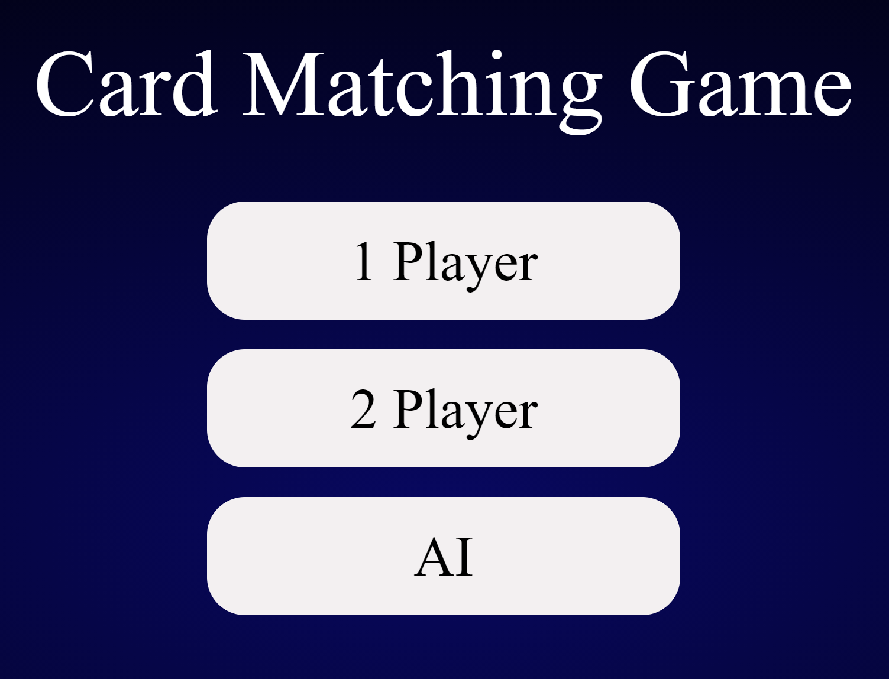
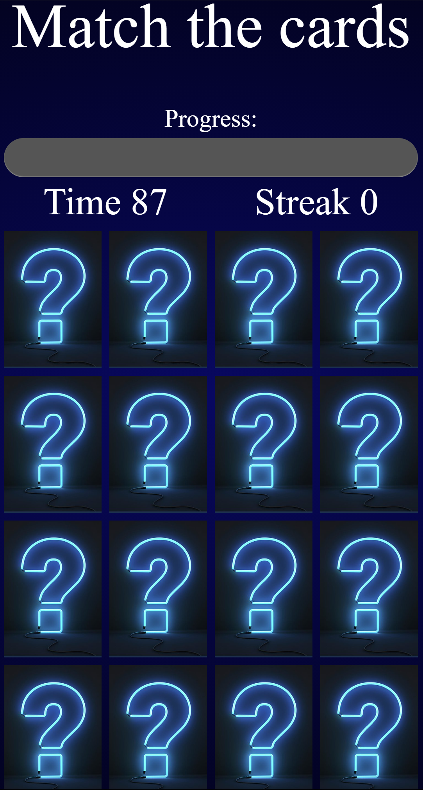

# Memory Game

Memory Game, also known as the Matching Game, is a simple card game where you need to match pairs by turn over 2 cards at a time.
   

## [Wireframe](https://wireframe.cc/soEvqN)

 

### [User Story](https://anotepad.com/notes/pdyr7skc)
 

# How it works

The player is provided of 16 cards on the table (8 couples of 2 identic cards). The goal of the game is to match all couples.
1. The game starts with all cards facing up for a second then it will flip down. 
2. then the timer starts when the page is loaded.
3. Click a card to flip it. Only two cards can be flipped in a move. If the two cards match they will permanently face up. 
4. If cards do not match, be sure to remember the card locations. The cards flip quickly after the second card is clicked, so be aware.
5. The aim of the game is to get the highest streak.
6. The game will end when all cards face up Or the time is out. 
7. You can then choose to play again or exit the game.
  

   
# Play

Either download the project or [play online](https://pages.git.generalassemb.ly/faisalabdulaziz/Card-Matching-Game/)
   
# EXTRA FEATURES

Add CSS animations when cards are clicked and successfully matched.\
Add Audio and sound effect.
   
# Future Updates

- [x] Adding 2 Player mode (1v1)
- [ ] Each player should have his/her own time
- [ ] Adding Playing with AI (Working on it)
- [ ] Adding more animations
- [ ] Adding score
- [ ] Adding more levels for difficulty 
   

# Technologies used 

- HTML
- CSS
- jquery
- javascript
 

## Run the game Requirement:

All application components are usable across modern desktop, tablet, and phone browsers.

   

# Special thanks:

Many many thanks to:\
[Mohammad Jouza](https://git.generalassemb.ly/MohammadJouza)\
[raymond](https://git.generalassemb.ly/raymond)\
[sameh kinawy](https://git.generalassemb.ly/samehkinawy)\
[jaber alsalamah](https://git.generalassemb.ly/jaberalsalamah)